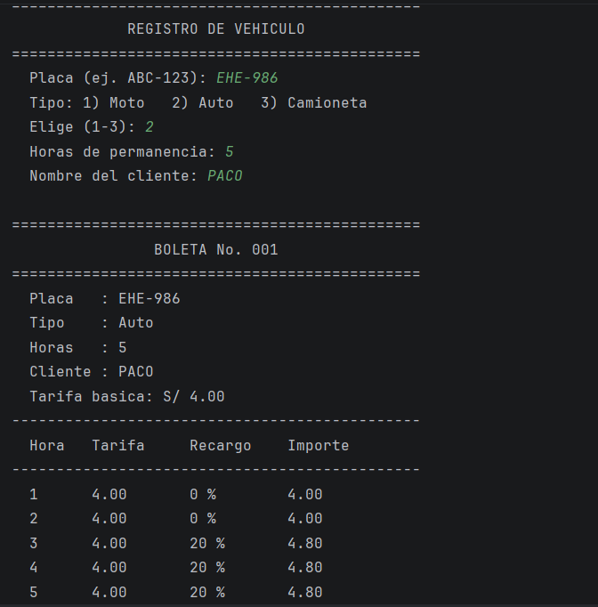
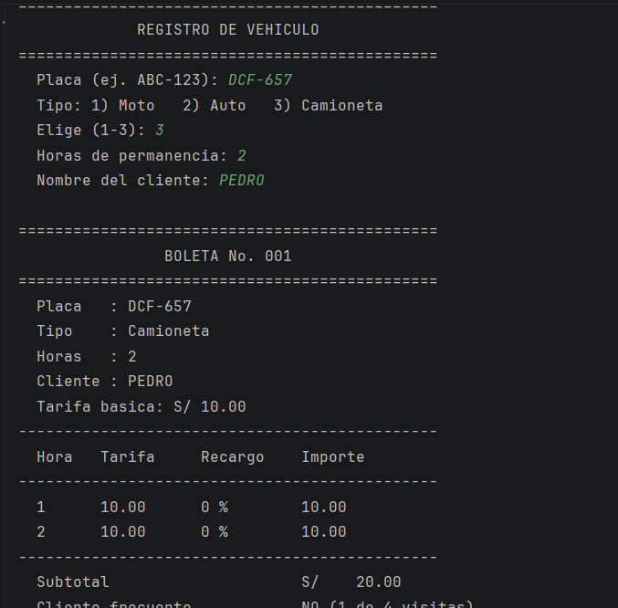

# Control de Estacionamiento — Kotlin (Semana 02)

Programa de consola en Kotlin que controla el ingreso de vehículos a un estacionamiento: 
registra placa, tipo, horas y cliente, calcula el importe con las reglas del profesor y genera 
una boleta con el detalle hora por hora, el descuento por cliente frecuente y el total a pagar.
Desarrollado en tres commits; para cada uno dejo el prompt que escribí.

## Commit 1 — Ingreso de datos

Necesito que me ayudes con un programa en Kotlin para mi curso de Programación Móvil. Es un control
de estacionamiento que corre en consola y lo voy a armar en tres partes para subirlo a GitHub por commits.
Esta primera parte es solo el ingreso de datos, sin cálculos todavía.

Cuando entre un carro, el programa debe preguntarme la placa, el tipo de vehículo, cuántas horas se va a quedar
y el nombre del cliente. Para el tipo solo existen tres opciones, moto, auto y camioneta, y quiero elegirlas con un 
número. La placa debe validarse con el formato peruano de tres caracteres, guion y tres caracteres, como ABC-123; si la escriben
en minúscula o sin guion, que el programa la corrija solo. La regla que no se puede romper es que ningún vehículo se registre con 
menos de una hora: si ponen cero, se rechaza y se explica el motivo.

Ármame un menú con tres opciones, registrar vehículo, ver la lista de vehículos registrados y salir, de modo que pueda registrar
varios seguidos sin cerrar el programa. Quiero que se vea ordenado en la consola, con títulos y líneas separadoras.

## Commit 2 — Cálculos

Sigo con el programa de estacionamiento en Kotlin. El ingreso de datos ya funciona; ahora necesito calcular cuánto paga cada vehículo.
La tarifa por hora depende del tipo: la moto paga 2 soles, el auto 4 soles y la camioneta 10 soles.

Las reglas son las que el profesor puso en la pizarra. Si el vehículo se queda hasta dos horas, paga la tarifa normal. Si se queda
más de dos y hasta cinco horas, cada una de esas horas lleva un recargo del 20 %. Si pasa de cinco horas, las horas posteriores a la 
quinta llevan un recargo del 50 %. El recargo se aplica hora por hora, no sobre toda la cuenta: un auto con tres horas paga 4.00 la primera,
4.00 la segunda y 4.80 la tercera, total 12.80.

Además hay un descuento del 10 % sobre el total para el cliente frecuente. Para saber quién es frecuente quiero usar la placa: si esa placa ya
vino más de tres veces, desde la cuarta visita le corresponde el descuento. Al registrar un vehículo debe mostrar la tarifa básica, el subtotal, si es 
cliente frecuente o no, el descuento y el total a pagar; en la lista de registrados, que aparezca el total de cada uno.

## Commit 3 — Mostrar resultados

Última parte del programa de estacionamiento. Los cálculos ya están correctos; ahora quiero que el resultado se muestre como una boleta con el formato
que nos dio el profesor. Primero la tarifa básica del vehículo y debajo una tabla con las columnas Hora, Tarifa, Recargo e Importe, con una fila por cada hora, 
donde se vea cuánto se cobró en esa hora y qué recargo le tocó. Después de la tabla, el subtotal, la línea de descuento si el cliente es frecuente y el total a
pagar bien destacado. Cada boleta debe llevar su número.

El menú debe tener cuatro opciones: registrar vehículo, ver el historial del día con todas las boletas y lo recaudado, buscar por placa para ver las boletas de 
ese vehículo y saber cuántas veces ha venido y si ya es cliente frecuente, y salir. Al salir, que muestre un resumen del día con los vehículos atendidos, el total sin 
descuento, el total de descuentos y el total recaudado. Las columnas deben quedar alineadas para que la tabla se lea bien en la consola.

