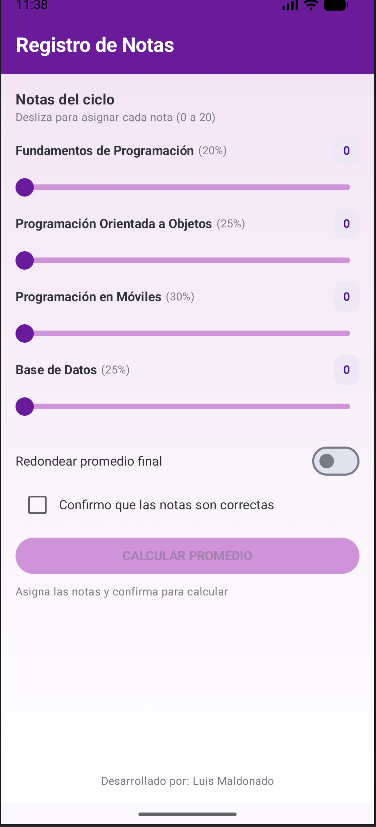
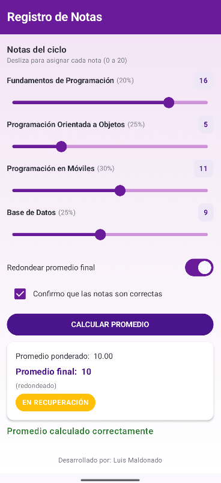

# Lab03 Tarea - Registro de Notas

- Autor: Luis Maldonado
- Curso: Programación en Móviles
- Ciclo: 4to Ciclo

## Descripción
La app calcula el promedio de 4 cursos de programación.
Cada curso tiene un peso distinto y la nota se asigna con un Slider
de 0 a 20. Con el Switch se puede redondear el promedio final y
el Checkbox habilita el botón de calcular. Y la app da el resultado.

## Controles usados
- Slider: para asignar la nota de cada curso
- Switch: para redondear el promedio final
- Checkbox: para confirmar las notas y habilitar el botón
- Button con enabled: se activa solo cuando el checkbox está marcado

## Capturas

- Estado inicial

- Promedio calculado
