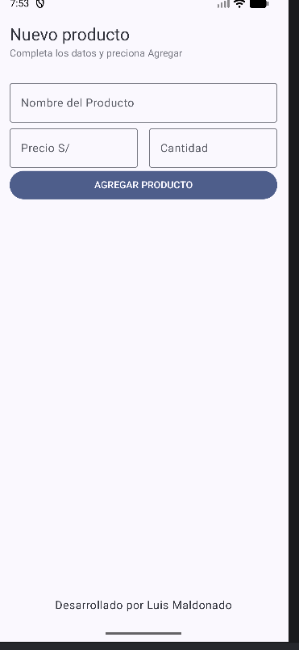
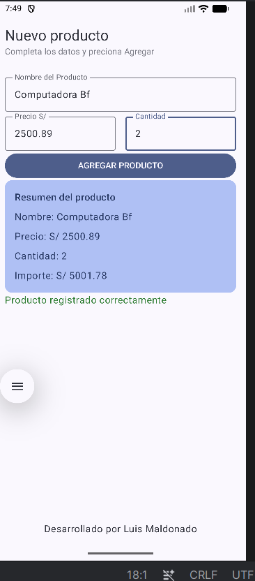

# Lab03 - Registro de Producto

- Autor:Luis Maldonado  
- Curso: Programación en Móviles  
- Ciclo: 4to Ciclo

## Descripción
La app se encarga de registar productos donde pide el nombre, el precio del producto
y las cantidades. Luego de completar todo eso, se aplasta el botón de AGREGAR PRODUCTO
y este da como un resumen con el nombre, el precio, la cantidad y por ultimo el importe ya calculado
y eso es todo.

## Capturas

Pantalla vacía

Con producto registrado

## ¿Qué pasa si declaras las variables SIN remember?
- Sin remember los campos se borran solos cada vez que se escriba un aletra, porque Compose
reinicia las variables en cada redibujado. Es decir sin remember los TextField quedan
inutilizables.

## Mejora con IA

**Prompt que usé:**
Validación de campos vacíos: cuando el usuario
presione el botón AGREGAR PRODUCTO sin llenar
nombre, precio o cantidad, mostrar un mensaje de
error en rojo debajo de cada campo vacío y NO
mostrar la Card de resumen hasta que todos los
campos estén llenos.Botón LIMPIAR debajo del botón AGREGAR PRODUCTO
que vacíe todos los campos y oculte la Card.

No cambies nada más del código.

**Qué generó Gemini:**
Validación con isBlank(), isError en cada campo,
mensajes en Color.Red debajo de cada campo vacío
y botón LIMPIAR que resetea todos los campos y estados.

**Qué acepté o corregí:**
Acepté todo el código de Gemini.
Yo agregué el cálculo de IGV al 18% y el total
con IGV dentro de la Card del resumen.
