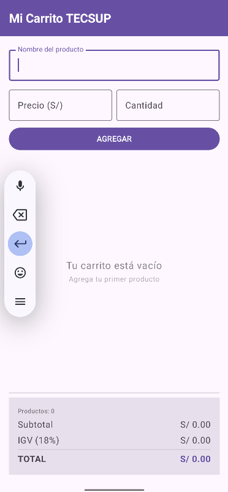
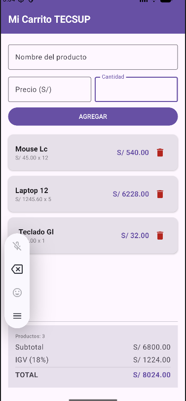

# Mi Carrito TECSUP — Lab 04

## Descripción
Aplicación Android en Jetpack Compose que simula un carrito de compras.
Permite agregar productos con nombre, precio y cantidad, muestra la
lista con tarjetas desplazables, elimina productos y calcula subtotal,
IGV 18% y total en tiempo real.

## Capturas
### Carrito vacío

### Carrito con productos

### ¿Por qué mutableStateListOf y no una MutableList normal?
mutableStateListOf crea una lista que Compose OBSERVA internamente.
Cuando se agrega o elimina un elemento, Compose detecta el cambio y
redibuja la LazyColumn automáticamente. Una MutableList normal no
tiene ese mecanismo, por lo que Compose nunca se entera del cambio
y la pantalla no se actualiza.

### ¿Por qué la lista es val si le agregamos elementos?
val en Kotlin prohíbe REASIGNAR la referencia, no modificar el
contenido. La variable siempre apunta al mismo SnapshotStateList,
solo cambian los elementos dentro de él.

### ¿Qué hace weight(1f) en la LazyColumn?
Le dice al Column padre que ocupe TODO el espacio vertical sobrante.
Sin weight, la lista crecería sin límite y el panel de totales
desaparecería. Con weight(1f) la lista es elástica y el panel
siempre queda fijo abajo.
