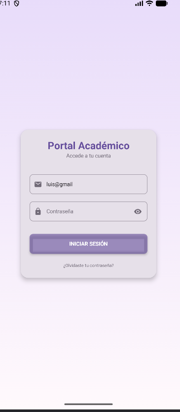
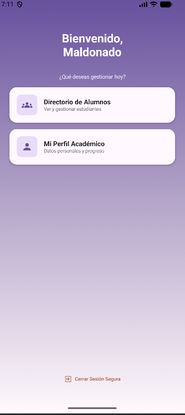
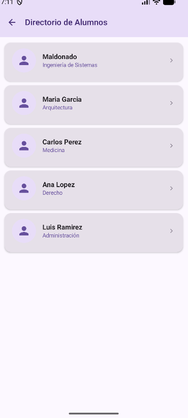
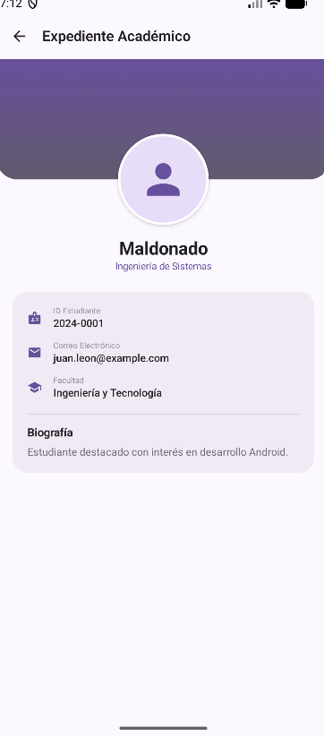
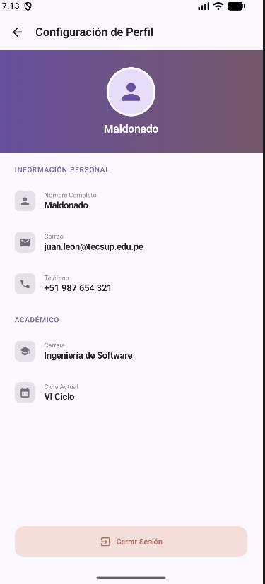

# Portal Académico — NavLab

Aplicación Android desarrollada con Kotlin y Jetpack Compose. Permite acceder a un portal de demostración, consultar un directorio de cinco alumnos,
visualizar sus expedientes académicos y consultar el perfil personal. Incluye navegación entre pantallas y cierre de sesión.

## Requerimientos funcionales

| Código | Requerimiento | Descripción |
|---|---|---|
| RF-01 | Acceder al portal académico | Permite ingresar correo y contraseña, mostrar u ocultar la contraseña y acceder al inicio cuando ambos campos están completos. El acceso es una simulación local. |
| RF-02 | Consultar el directorio de alumnos | Muestra cinco alumnos con su nombre, carrera y avatar. Permite seleccionar un alumno para abrir su expediente académico. |
| RF-03 | Visualizar el expediente académico | Muestra el nombre, carrera, ID, correo, facultad y biografía del alumno seleccionado, según los datos disponibles. Permite regresar al directorio. |
| RF-04 | Consultar el perfil y cerrar sesión | Muestra nombre completo, correo, teléfono, carrera y ciclo. Permite cerrar sesión desde Inicio o Perfil y regresar al acceso sin poder volver a las pantallas internas mediante el botón Atrás. |

## Capturas de pantalla

### Portal Académico

### Inicio

### Directorio de Alumnos

### Expediente Académico

### Configuración de Perfil

## Prompt utilizado

Ver el prompt completo

Implementa directamente en mi proyecto Android NavLab las cinco pantallas descritas en este prompt. No recibirás imágenes: toda la especificación visual y funcional está aquí.

Quiero que sigas esta descripción con precisión. No propongas otro diseño ni agregues funciones, textos o elementos decorativos que no estén indicados.

CONTEXTO DEL PROYECTO

Proyecto ubicado en Semana05.

Paquete: com.maldonado.navlab.

Lenguaje: Kotlin.

Interfaz: Jetpack Compose.

Componentes: Material 3.

Navegación: Navigation Compose.

Rama de trabajo: semana05-gemini.

Ya existen:

MainActivity.kt.

navigation/Screen.kt.

navigation/AppNavigation.kt.

screens/HomeScreen.kt.

screens/ListScreen.kt.

screens/DetailScreen.kt.

screens/ProfileScreen.kt.

ui/theme.

Inspecciona el proyecto antes de modificarlo. Comprueba que la rama actual sea semana05-gemini. Si es otra, detente e informa.

Trabaja únicamente dentro de Semana05. No modifiques otras semanas, no cambies de rama, no hagas merge y no ejecutes commits ni push.

Conserva el paquete, las versiones y la configuración actual de Gradle y SDK, salvo que un problema concreto de compilación requiera un ajuste mínimo y justificado.

Realiza los cambios en los archivos del proyecto. No te limites a dar instrucciones o fragmentos de código.

OBJETIVO

Transformar la aplicación básica de navegación en un portal académico con cinco pantallas:

Inicio de sesión.

Inicio con bienvenida.

Directorio de alumnos.

Expediente académico.

Configuración de perfil.

Usa navegación funcional y datos locales. No integres bases de datos, servicios externos ni autenticación real.

MIS DATOS

Utiliza estos datos de manera consistente:

Nombre corto: Luis Maldonado.

Nombre completo: Luis Miguel Maldonado Linares.

Nombre para el saludo: Luis Miguel.

Carrera: Diseño y Desarrollo de Software.

No debe aparecer Juan León ni Juan León Suiyon en textos de interfaz, datos de ejemplo o descripciones de accesibilidad.

No conozcas ni inventes mi correo, teléfono, código de estudiante, facultad o ciclo actual. En esos valores muestra “—”.

No escribas una biografía inventada. En el campo de biografía muestra “—”.

No utilices una fotografía de otra persona como si fuera mía.

ESPECIFICACIÓN VISUAL GENERAL

Toma como referencia un área útil vertical de 360 dp de ancho y aproximadamente 760 dp de alto, excluyendo las barras del sistema.

En dispositivos diferentes:

Conserva los márgenes y la distribución general.

Ajusta los anchos al espacio disponible.

Evita recortes.

Permite desplazamiento cuando la altura no alcance.

Evita que el teclado cubra los campos de acceso.

Tipografía:

Sans serif de Android, preferentemente Roboto.

Títulos principales: 24 sp, Bold.

Títulos de barras superiores: 18 sp, SemiBold.

Títulos de tarjetas: 15 sp, Bold.

Valores de datos: 14 sp.

Textos secundarios: 12 sp.

Etiquetas pequeñas: 10 sp.

Encabezados de sección: 11 sp, SemiBold, con letterSpacing de 1 sp.

Paleta fija:

Fondo principal: #FCF8FF.

Morado principal: #67509D.

Morado oscuro: #493278.

Lila claro: #E8DDF8.

Tarjetas del directorio: #E6E0E9.

Tarjeta del expediente: #F0EAF4.

Texto principal: #242126.

Texto secundario: #726B78.

Etiquetas: #938B99.

Bordes de campos: #A69FAB.

Separadores: #D7CEDD.

Texto e iconos de cerrar sesión: #B66D5F.

Fondo del botón de cerrar sesión: #F3DEDA.

Usa estos valores como especificación de implementación; no son colores que debas recalcular.

Desactiva los colores dinámicos para que el dispositivo no cambie la paleta. Mantén estas pantallas con apariencia clara, incluso si el dispositivo está en modo oscuro.

Estilo:

Fondos suaves.

Tarjetas claras.

Sombras discretas.

Esquinas redondeadas.

Iconos pequeños.

Amplios espacios vacíos.

Sin decoraciones adicionales.

Configura los componentes de Material 3 explícitamente cuando sus valores predeterminados no coincidan con las medidas indicadas.

No dibujes un teléfono, una cámara, una hora falsa ni barras de sistema falsas. Usa las barras reales, con iconos oscuros y fondos integrados con cada pantalla.

PANTALLA 1: PORTAL ACADÉMICO

Crea screens/LoginScreen.kt.

Esta pantalla será el destino inicial.

Fondo:

Degradado vertical de #E8DCFA arriba a #FFF9FC abajo.

Ocupa toda la pantalla.

Sin TopAppBar.

Tarjeta de acceso:

Centrada horizontalmente.

Ancho de 304 dp en una pantalla de 360 dp.

Márgenes laterales de 28 dp.

Altura aproximada de 350 dp, adaptable al contenido.

Centro situado aproximadamente al 48 % de la altura útil.

Fondo #E6E0E9.

Esquinas de 18 dp.

Elevación de 6 dp.

Padding horizontal de 20 dp.

Padding vertical de 22 dp.

Contenido exacto, de arriba abajo:

Título:
“Portal Académico”
Centrado.
Color #67509D.
23 sp.
Bold.

Subtítulo:
“Accede a tu cuenta”
Centrado.
Color #726B78.
12 sp.
Separación de 2 dp respecto al título.

Espacio de 34 dp.

Campo de correo:
Placeholder: “Correo Institucional”.
Altura visual de 44 dp.
Ancho completo del contenido de la tarjeta.
Esquinas de 8 dp.
Borde de 1 dp, color #A69FAB.
Fondo transparente.
Icono de sobre a la izquierda, 18 dp, gris oscuro.
Texto de 12 sp.
Padding horizontal de 10 dp.
Una sola línea.
Teclado de correo.
No agregues etiqueta flotante exterior.

Espacio de 16 dp.

Campo de contraseña:
Placeholder: “Contraseña”.
Mismas dimensiones y estilo que el campo anterior.
Icono de candado a la izquierda.
Icono de ojo tachado a la derecha.
Iconos de 18 dp.
Contraseña oculta inicialmente.
El icono derecho alterna entre mostrar y ocultar.
Una sola línea.
Sin etiqueta flotante exterior.

Espacio de 28 dp.

Botón:
Texto: “INICIAR SESIÓN”.
Altura visual de 44 dp.
Ancho completo del contenido.
Fondo #67509D.
Texto blanco.
12 sp, Bold.
Esquinas de 8 dp.
Elevación de 3 dp.
No convertirlo en una píldora.

Espacio de 20 dp.

Texto inferior:
“¿Olvidaste tu contraseña?”
Centrado.
10 sp.
Color #726B78.
Sin subrayado.

Mantén áreas táctiles de al menos 48 dp donde corresponda, sin agrandar innecesariamente los elementos visuales.

Comportamiento:

Los dos campos permiten escribir.

Conserva su estado durante recomposiciones.

El botón permite continuar cuando el correo y la contraseña tienen contenido.

Si falta alguno, permanece en la pantalla.

Esta es una simulación local, no autenticación real.

No agregues mensajes, diálogos ni nuevas pantallas.

No guardes ni registres la contraseña.

Al cerrar sesión, borra la contraseña.

El texto de recuperación es únicamente visual; no inventes un flujo para él.

PANTALLA 2: INICIO

Adapta screens/HomeScreen.kt.

Fondo:

Degradado vertical.

Arriba: #67509D.

Centro: #B6A7CA.

Abajo: #FFF9FC.

Sin TopAppBar.

El contenido principal empieza aproximadamente al 18 % de la altura útil.

Encabezado exacto en dos líneas:
“Bienvenido,”
“Luis Miguel”

Estilo:

Centrado.

Blanco.

26 sp.

Bold.

Interlineado de 30 sp.

Debajo:

Espacio de 32 dp.

Texto: “¿Qué deseas gestionar hoy?”

Centrado.

Blanco con opacidad de 90 %.

12 sp.

Primera tarjeta:

Separación de 16 dp desde el subtítulo.

Márgenes horizontales de 22 dp.

Altura de 70 dp.

Fondo #FFF9FF.

Esquinas de 16 dp.

Elevación de 4 dp.

Padding interior de 16 dp.

Contenido horizontal centrado verticalmente.

A la izquierda:

Recuadro de 46 × 46 dp.

Fondo #E8DDF8.

Esquinas de 10 dp.

Icono de grupo de personas de 24 dp.

Color del icono #67509D.

A la derecha:

Separación de 14 dp desde el recuadro.

Título: “Directorio de Alumnos”.

15 sp, Bold, #242126.

Subtítulo: “Ver y gestionar estudiantes”.

11 sp, #726B78.

Sin flecha al extremo derecho.

Segunda tarjeta:

Separación de 14 dp desde la primera.

Mismas dimensiones y estilo.

Icono de una persona.

Título: “Mi Perfil Académico”.

Subtítulo: “Datos personales y progreso”.

Sin flecha al extremo derecho.

Acción inferior:

Centrada horizontalmente.

A 28 dp del borde inferior del área útil.

Icono de salida de 18 dp.

Separación de 6 dp entre icono y texto.

Texto: “Cerrar Sesión Segura”.

11 sp, SemiBold.

Color #B66D5F.

Sin fondo sólido, tarjeta ni borde.

Conserva un espacio vacío amplio entre las tarjetas y esta acción.

Comportamiento:

Directorio de Alumnos abre la lista.

Mi Perfil Académico abre el perfil.

Cerrar Sesión Segura vuelve al acceso y limpia la pila.

PANTALLA 3: DIRECTORIO DE ALUMNOS

Adapta screens/ListScreen.kt.

Fondo #FCF8FF.

Barra superior:

Altura de 56 dp.

Fondo #E8DDF8.

Flecha de regreso a la izquierda.

Icono de 22 dp dentro de un área táctil mínima de 48 dp.

Título: “Directorio de Alumnos”.

18 sp, SemiBold.

Color #493278.

Lista:

Usa LazyColumn.

Empieza a 12 dp de la barra superior.

Márgenes horizontales de 12 dp.

Cinco tarjetas.

Separación vertical de 10 dp.

Sin buscador, filtros ni encabezados adicionales.

Tarjetas:

Altura mínima de 84 dp.

Ancho disponible completo.

Fondo #E6E0E9.

Esquinas de 14 dp.

Elevación de 2 dp.

Padding horizontal de 16 dp.

Contenido centrado verticalmente.

Interior:

Retrato circular de 52 dp a la izquierda.

Espacio de 14 dp.

Columna con nombre y carrera.

Nombre: 15 sp, Bold, #242126.

Carrera: 12 sp, #67509D.

Permite dos líneas para “Diseño y Desarrollo de Software”; no lo recortes.

Chevron derecho de 18 dp, color #938B99.

Toda la tarjeta permite seleccionar al alumno.

Registros exactos y en este orden:

Luis Maldonado
Diseño y Desarrollo de Software

Maria Garcia
Arquitectura

Carlos Perez
Medicina

Ana Lopez
Derecho

Luis Ramirez
Administración

No confundas a Luis Maldonado con Luis Ramirez: son registros distintos.

No agregues alumnos ni cambies los nombres de los otros cuatro.

El espacio debajo de las cinco tarjetas permanece vacío.

Comportamiento:

Flecha superior: regresar al inicio.

Seleccionar alumno: abrir su expediente mediante su identificador.

PANTALLA 4: EXPEDIENTE ACADÉMICO

Adapta screens/DetailScreen.kt.

Recibe el identificador entero del alumno desde Navigation Compose y consulta los datos locales correspondientes.

Fondo #FCF8FF.

Barra superior:

Altura de 56 dp.

Fondo #FCF8FF.

Flecha de regreso oscura.

Título: “Expediente Académico”.

18 sp, SemiBold, #242126.

Cabecera decorativa:

Debajo de la barra.

Ancho completo.

Altura de 148 dp.

Degradado vertical de #67509D arriba a #625A6D abajo.

Esquinas inferiores de 26 dp.

Esquinas superiores rectas.

Retrato:

Circular.

Tamaño de 112 dp.

Centrado horizontalmente.

Superpuesto al borde inferior de la cabecera.

El centro del retrato coincide aproximadamente con ese borde.

Borde blanco de 3 dp.

Sombra de 3 dp.

ContentScale.Crop cuando exista una fotografía.

Debajo:

Espacio de 16 dp desde el borde inferior del retrato.

Nombre del alumno, centrado.

22 sp, Bold, #242126.

Carrera debajo.

Separación de 2 dp.

Carrera en 12 sp y #67509D.

Permite dos líneas si es necesario.

Para mi registro muestra:
“Luis Maldonado”
“Diseño y Desarrollo de Software”

Tarjeta de información:

A 28 dp de la carrera.

Márgenes horizontales de 20 dp.

Fondo #F0EAF4.

Esquinas de 18 dp.

Sin sombra marcada.

Padding de 18 dp.

Tres filas:

Icono morado a la izquierda, 18 dp.

Espacio de 14 dp entre icono y texto.

Etiqueta de 10 sp, #938B99.

Valor de 13 sp, Medium, #242126.

Espacio de 14 dp entre filas.

Contenido de mi expediente:

Icono de identificación.
Etiqueta: “ID Estudiante”.
Valor: “—”.

Icono de sobre.
Etiqueta: “Correo Electrónico”.
Valor: “—”.

Icono de birrete.
Etiqueta: “Facultad”.
Valor: “—”.

Después:

Espacio de 18 dp.

Separador de 1 dp, #D7CEDD.

Espacio de 14 dp.

Título: “Biografía”.

14 sp, Bold.

Espacio de 8 dp.

Valor: “—”.

13 sp, #726B78.

Alineación izquierda.

Para los otros cuatro alumnos:

Usa su nombre y carrera del directorio.

Usa su fotografía únicamente si existe un recurso identificado.

Muestra “—” en ID, correo, facultad y biografía.

No inventes datos adicionales.

No agregues notas, cursos, promedios, botones de edición ni otras secciones.

La flecha superior regresa al directorio.

PANTALLA 5: CONFIGURACIÓN DE PERFIL

Adapta screens/ProfileScreen.kt.

Fondo #FCF8FF.

Barra superior:

Altura de 56 dp.

Fondo #FCF8FF.

Flecha de regreso.

Título exacto: “Configuración de Perfil”.

18 sp, SemiBold, #242126.

Cabecera:

Ancho completo.

Altura mínima de 160 dp para acomodar mi nombre completo.

Esquinas rectas.

Degradado horizontal de #67509D a la izquierda a #745869 a la derecha.

Contenido:

Retrato circular de 76 dp, centrado.

Margen superior de 18 dp.

Borde claro de 3 dp.

Espacio de 10 dp debajo.

Nombre completo:
“Luis Miguel Maldonado Linares”

Blanco.

17 sp, Bold.

Centrado.

Márgenes horizontales de 20 dp.

Permite dos líneas sin puntos suspensivos.

Si necesita dos líneas, presenta:
“Luis Miguel”
“Maldonado Linares”.

Contenido inferior:

Padding horizontal de 24 dp.

Primer encabezado a 20 dp de la cabecera.

Encabezado:
“INFORMACIÓN PERSONAL”

11 sp, SemiBold.

Color #806A9F.

LetterSpacing de 1 sp.

Filas:

Primera a 16 dp del encabezado.

Altura mínima de 52 dp por fila, adaptable a textos largos.

Recuadro de icono de 32 × 32 dp.

Fondo #E6E0E9.

Esquinas de 8 dp.

Icono gris oscuro de 18 dp.

Espacio de 14 dp entre recuadro y texto.

Etiqueta de 10 sp, #938B99.

Valor de 14 sp, SemiBold, #242126.

Fila 1:

Icono de persona.

Etiqueta: “Nombre Completo”.

Valor: “Luis Miguel Maldonado Linares”.

Permite dos líneas sin recortar.

Fila 2:

Icono de sobre.

Etiqueta: “Correo”.

Valor: “—”.

Fila 3:

Icono de teléfono.

Etiqueta: “Teléfono”.

Valor: “—”.

Después:

Espacio de 24 dp.

Encabezado: “ACADÉMICO”.

Mismo estilo del encabezado anterior.

Primera fila académica:

A 16 dp del encabezado.

Icono de birrete.

Etiqueta: “Carrera”.

Valor: “Diseño y Desarrollo de Software”.

Permite dos líneas.

Segunda fila académica:

Icono de calendario.

Etiqueta: “Ciclo Actual”.

Valor: “—”.

Botón inferior:

A 20 dp del borde inferior del área útil.

Márgenes horizontales de 24 dp.

Altura visual de 30 dp.

Área táctil mínima de 48 dp.

Fondo #F3DEDA.

Esquinas de 15 dp.

Sin sombra.

Icono de salida de 18 dp.

Texto: “Cerrar Sesión”.

12 sp, Bold.

Texto e icono de color #B66D5F.

Contenido centrado.

Mantén un espacio vacío amplio entre los datos académicos y el botón cuando haya altura suficiente. Si la pantalla es pequeña, permite desplazar el contenido sin que se superponga con el botón.

Comportamiento:

Flecha superior: inicio.

Cerrar Sesión: acceso, limpiando la pila.

FOTOGRAFÍAS

No voy a adjuntar fotografías en esta tarea.

Busca si existen recursos claramente identificados en el proyecto. No asumas que una foto cualquiera es mía.

Para Luis Maldonado:

Utiliza mi fotografía solo si existe un recurso identificado como mío.

Si no existe, muestra un círculo de fondo neutro #E6E0E9.

Sin iniciales, emojis, texto ni fotografía de otra persona.

Conserva las dimensiones y los bordes especificados.

Deja la implementación preparada para incorporar la fotografía después.

Para Maria Garcia, Carlos Perez, Ana Lopez y Luis Ramirez:

Usa recursos locales solo si están disponibles e identificados.

Si faltan, conserva círculos neutros.

No descargues ni generes personas aleatorias.

Utiliza el mismo recurso de mi fotografía, cuando esté disponible, en directorio, expediente y perfil.

ICONOS

Necesitarás:

Flecha de regreso.

Sobre.

Candado.

Visibilidad y visibilidad desactivada.

Grupo de personas.

Persona.

Salida.

Chevron derecho.

Identificación.

Birrete.

Teléfono.

Calendario.

Reutiliza los iconos disponibles en el proyecto. Si falta uno, prioriza un recurso vectorial local.

No agregues una dependencia grande únicamente para uno o dos iconos. No sustituyas iconos por emojis o caracteres de texto.

NAVEGACIÓN Y ORGANIZACIÓN

Conserva:

MainActivity.kt como entrada.

Screen.kt como definición central de rutas.

AppNavigation.kt como grafo.

screens para las pantallas.

ui.theme para los colores y el tema.

Añade:

LoginScreen.kt.

Un modelo Alumno y una fuente de datos local si son necesarios.

Rutas:

login.

home.

list.

detail/{itemId}.

profile.

Usa identificadores estables y distintos para los cinco alumnos.

Flujos:

login → home.

home → list.

list → detail/{itemId}.

detail → list.

list → home.

home → profile.

profile → home.

home → login al cerrar sesión.

profile → login al cerrar sesión.

Al entrar:

Retira login de la pila.

Evita que Atrás regrese al formulario.

Al cerrar sesión:

Limpia las pantallas internas.

Evita que Atrás reabra el portal.

No agregues persistencia de sesión ni guardes contraseñas.

RESTRICCIONES

No agregues:

Chatbot o API de Gemini dentro de la app.

Firebase.

Base de datos.

Servicios de autenticación.

Registro de usuarios.

Recuperación real de contraseña.

Formularios de edición.

Buscadores.

Filtros.

Barra de navegación inferior.

Menú lateral.

Botones flotantes.

Estadísticas.

Cursos.

Calificaciones.

Nuevos alumnos.

Logos.

Animaciones decorativas.

Pantallas adicionales.

Textos de explicación dentro de las interfaces.

Gemini se usa para implementar el proyecto; no es una funcionalidad visible del portal.

No modifiques el README ni otros documentos.

ADAPTACIÓN Y ACCESIBILIDAD

Usa dp y sp.

Respeta los insets del sistema.

Evita aplicar dos veces el espacio de las barras.

No coloques contenido debajo de la cámara ni de la navegación del sistema.

Mantén áreas táctiles adecuadas.

Proporciona contentDescription a iconos interactivos.

Los iconos decorativos pueden tener contentDescription nulo.

No recortes mi nombre completo ni mi carrera.

No uses una captura como interfaz: todos los elementos deben ser componentes reales.

Maneja el teclado y el desplazamiento del formulario.

Conserva los colores especificados independientemente del fondo de pantalla del dispositivo.

ORDEN DE TRABAJO

Comprueba la rama y revisa el código.

Configura la paleta y el tema.

Define los datos locales.

Implementa LoginScreen.

Adapta HomeScreen.

Adapta ListScreen.

Adapta DetailScreen.

Adapta ProfileScreen.

Conecta la navegación.

Compila.

Corrige los errores.

Ejecuta y verifica las pantallas si tienes acceso a un emulador.

VERIFICACIÓN FINAL

Comprueba, si las herramientas lo permiten:

Aparece Portal Académico al abrir la app.

Los campos permiten escribir.

El ojo muestra y oculta la contraseña.

El acceso con ambos campos completos abre el inicio.

El saludo dice “Bienvenido, Luis Miguel”.

El directorio contiene exactamente cinco alumnos.

El primer alumno es Luis Maldonado.

Su carrera es Diseño y Desarrollo de Software.

Seleccionar cada alumno abre su propio expediente.

El perfil muestra Luis Miguel Maldonado Linares.

No aparece Juan León ni Juan León Suiyon.

Los datos personales no proporcionados muestran “—”.

Las flechas regresan al destino correcto.

Cerrar sesión vuelve al acceso y limpia la pila.

No existen superposiciones ni textos recortados.

Los botones inferiores permanecen accesibles.

Los colores permanecen fijos.

No afirmes haber ejecutado pruebas que no pudiste realizar. Si no tienes emulador, informa que la verificación visual queda pendiente.

ENTREGA FINAL

Al terminar, indica brevemente:

Qué archivos modificaste.

Si la compilación terminó correctamente.

Qué recorridos verificaste realmente.

Si faltan fotografías u otros recursos.

No hagas commits ni push. Deja los cambios listos para que yo los revise y los guarde en semana05-gemini.

ACLARACIÓN FINAL OBLIGATORIA: FIDELIDAD A LAS CINCO CAPTURAS

Conserva íntegro el prompt anterior. Este bloque precisa mi solicitud final y prevalece únicamente en los puntos donde exista contradicción con el texto anterior. Mantén todas las demás restricciones, funcionalidades, navegación y límites del proyecto.

Sí se proporcionan cinco capturas como referencia visual. Reproduce sus pantallas con la misma distribución, textos, colores, degradados, tamaños relativos, márgenes, espacios vacíos, tarjetas, retratos e iconos. No rediseñes, no reubiques elementos, no añadas contenido visible ni elimines elementos mostrados. Las capturas mandan sobre las medidas aproximadas anteriores si hubiera diferencias visuales. No copies el marco físico del teléfono ni dibujes sus barras del sistema.

ÚNICA SUSTITUCIÓN DE NOMBRE

Donde las capturas muestran “Juan León” o “Juan León Suiyon”, muestra exactamente “Maldonado”. Aplica esta sustitución al saludo, primer alumno, expediente, cabecera de perfil y valor de Nombre Completo. No uses “Luis Miguel”, “Luis Maldonado” ni “Luis Miguel Maldonado Linares” en esos lugares. No cambies a los otros cuatro alumnos.

TEXTOS EXACTOS DE LAS CAPTURAS

Pantalla 1 — Acceso:

Portal Académico

Accede a tu cuenta

Correo Institucional

Contraseña

INICIAR SESIÓN

¿Olvidaste tu contraseña?

Pantalla 2 — Inicio:

Encabezado en dos líneas: “Bienvenido,” y “Luis Maldonado”.

¿Qué deseas gestionar hoy?

Directorio de Alumnos

Ver y gestionar estudiantes

Mi Perfil Académico

Datos personales y progreso

Cerrar Sesión Segura

Pantalla 3 — Directorio:

Directorio de Alumnos

Maldonado / Ingeniería de Sistemas

Maria Garcia / Arquitectura

Carlos Perez / Medicina

Ana Lopez / Derecho

Luis Ramirez / Administración
Respeta ese orden y los cinco registros. Cada carrera va debajo de su nombre.

Pantalla 4 — Expediente del primer alumno:

Expediente Académico

Maldonado

Ingeniería de Sistemas

ID Estudiante

2024-0001

Correo Electrónico

luis.maldonado@example.com

Facultad

Ingeniería y Tecnología

Biografía

Estudiante destacado con interés en desarrollo Android.

Pantalla 5 — Perfil:

Configuración de Perfil

Maldonado (debajo del retrato de la cabecera)

INFORMACIÓN PERSONAL

Nombre Completo

Luis Maldonado Linares

Correo

luis.maldonado@tecsup.edu.pe

Teléfono

+51 987 654 321

ACADÉMICO

Carrera

Ingeniería de Software

Ciclo Actual

VI Ciclo

Cerrar Sesión

Estos valores reproducen datos de demostración de las capturas; no se presentan como mis datos personales reales. Conserva literalmente los correos y el teléfono de ejemplo: la sustitución solicitada afecta al nombre visible, no a las direcciones de correo. No los reemplaces por “—”. Conserva la diferencia entre “Ingeniería de Sistemas” del directorio y expediente e “Ingeniería de Software” del perfil. No la corrijas ni la unifiques. Para expedientes de los otros cuatro alumnos conserva el comportamiento anterior y no inventes datos no mostrados.

DISTRIBUCIÓN E ICONOS: NO MODIFICAR EL DISEÑO

Acceso: tarjeta centrada, sobre al inicio del correo, candado al inicio de contraseña y ojo tachado al extremo derecho. Conserva el botón morado y el texto de recuperación en sus posiciones.

Inicio: saludo superior, subtítulo, dos tarjetas apiladas; grupo de personas en la primera y persona en la segunda. Sin flechas en esas tarjetas. “Cerrar Sesión Segura” con icono de salida permanece abajo, centrado, separado por el espacio vacío mostrado. No lo muevas debajo de las tarjetas.

Directorio: flecha de regreso en la barra superior; cinco tarjetas con retrato circular a la izquierda y chevron a la derecha. Conserva el espacio vacío inferior.

Expediente: flecha de regreso arriba; franja morada con esquinas inferiores redondeadas; retrato circular superpuesto al borde inferior; nombre y carrera centrados debajo; tarjeta de información con identificación, sobre y birrete; separador y biografía dentro de esa tarjeta.

Perfil: flecha de regreso arriba; cabecera con degradado horizontal, retrato y nombre; sección personal con iconos de persona, sobre y teléfono; sección académica con birrete y calendario. “Cerrar Sesión” permanece en el botón rosado inferior, centrado y con icono de salida. No lo subas junto a los datos académicos.

Incluye todos los iconos que aparecen en las capturas con la misma función, ubicación, color y tamaño relativo. No añadas otros ni uses emojis o texto como sustitutos. Reutiliza los recursos disponibles o crea vectores locales equivalentes si faltan. Esto no autoriza cambios de diseño.

Conserva el funcionamiento del ojo de contraseña y la navegación ya indicada.

Los retratos de las capturas son recursos de referencia de esta maqueta, no fotografías personales mías. Si esos recursos están disponibles, reutilízalos; para el primer alumno usa el mismo retrato en directorio, expediente y perfil. No sustituyas por otra persona aleatoria. Si no están disponibles como imágenes utilizables, informa de esa limitación en la entrega y conserva el espacio circular previsto; no afirmes una coincidencia visual exacta de las fotografías.

Comprueba las cinco pantallas contra las referencias. La verificación anterior debe usar los textos finales de este bloque, incluidos “Maldonado” y los valores de ejemplo, en lugar de los nombres largos y guiones anteriores.

REQUISITO FINAL DE ENTREGA: COMPONENTES INDEPENDIENTES, FUERA DE MAIN

Entrega e implementa las pantallas y los componentes de manera independiente, en archivos Kotlin separados. No concentres la interfaz dentro de MainActivity.kt, de una función main, de onCreate ni de un único archivo enorme.

MainActivity.kt queda únicamente como punto de entrada: configura el tema y llama a AppNavigation.

navigation/Screen.kt conserva las rutas.

navigation/AppNavigation.kt contiene el grafo de navegación.

Cada pantalla permanece en su propio archivo dentro de screens/: LoginScreen.kt, HomeScreen.kt, ListScreen.kt, DetailScreen.kt y ProfileScreen.kt.

Los componentes visuales extraídos se ubican en components/, cada uno en su propio archivo: por ejemplo, AcademicTopBar.kt, LoginCard.kt, HomeOptionCard.kt, StudentCard.kt, StudentAvatar.kt, AcademicInfoCard.kt, ProfileHeader.kt, ProfileInfoRow.kt y LogoutAction.kt. Son partes de las pantallas existentes, no elementos visibles nuevos.

Define cada componente como una función @Composable independiente, con sus parámetros y callbacks; no como función local anidada dentro de MainActivity ni dentro de otra pantalla.

Mantén los datos y el modelo Alumno fuera de MainActivity, en archivos propios. Mantén colores y tema en ui/theme.

Reutiliza componentes únicamente si conservan exactamente la apariencia de cada captura. En particular, la salida sin fondo del inicio y el botón rosado del perfil deben mantener sus diferencias.

Además de modificar los archivos reales del proyecto, presenta el código completo de cada archivo creado o modificado por separado, indicando su ruta, con imports y sin omisiones ni pseudocódigo, para poder copiar cada componente de manera independiente.

Finaliza indicando el resultado real de compilación y comprobaciones. No hagas commits ni push.

