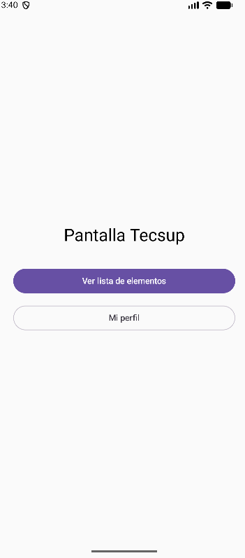
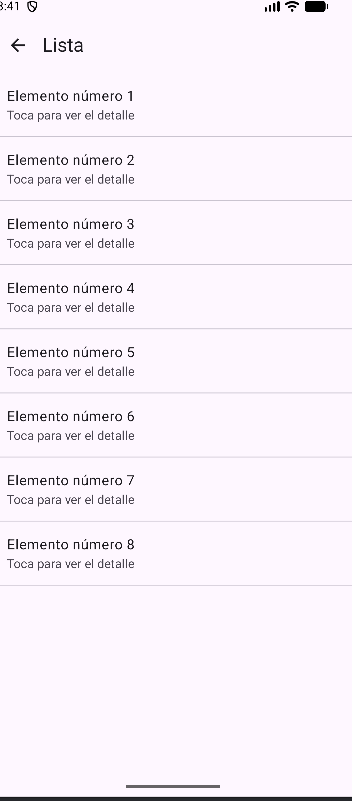
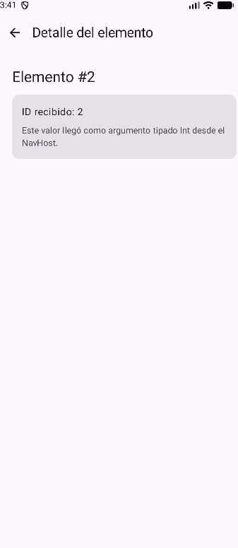
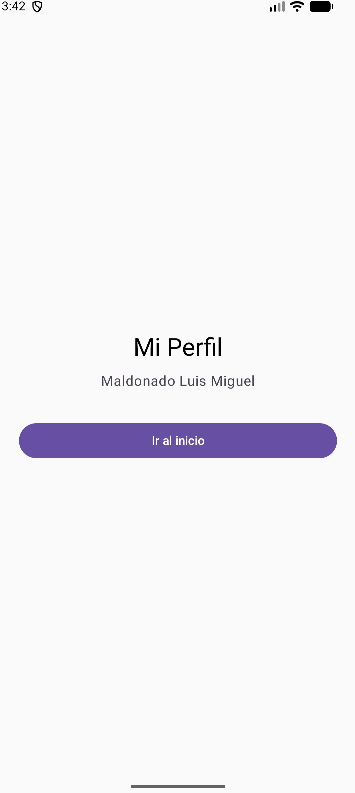

# Laboratorio 05: Navegación en Jetpack Compose

**Estudiante:** Luis Miguel Maldonado Linares

## Descripción

Aplicación Android desarrollada en Kotlin con Jetpack Compose.
Permite navegar entre las pantallas de inicio, lista, detalle y
perfil utilizando Navigation Compose.

## Requerimientos funcionales

### RF-01: Mostrar la pantalla de inicio

La aplicación debe mostrar el título “Pantalla Tecsup” y dos
botones: “Ver lista de elementos” y “Mi perfil”. Cada botón
debe dirigir al usuario a la pantalla correspondiente.

### RF-02: Mostrar la lista de elementos

La aplicación debe presentar ocho elementos numerados del 1 al 8.
Cada elemento debe mostrar el texto “Toca para ver el detalle”
y permitir abrir su detalle al seleccionarlo.

### RF-03: Mostrar el detalle del elemento seleccionado

La aplicación debe recibir el identificador del elemento
seleccionado como un número entero y mostrarlo en el título
“Elemento #” y en una tarjeta con el texto “ID recibido”.

### RF-04: Mostrar el perfil y permitir volver al inicio

La aplicación debe mostrar el título “Mi Perfil”, el nombre
configurado en el código y el botón “Ir al inicio”. Al pulsarlo,
debe regresar a la pantalla principal y limpiar la pila de
navegación para evitar acumular pantallas de inicio.

## Comprobación de los requerimientos
| Requerimiento | Acción de prueba | Resultado esperado | Captura |
|---|---|---|-|
| RF-01 | Pulsar cada botón de inicio. | Se abre la lista o el perfil, según el botón. |  |
| RF-02 | Abrir la lista y seleccionar un elemento. | Se muestran ocho elementos y se abre el detalle del seleccionado. | |
| RF-03 | Seleccionar el elemento 3 y luego pulsar la flecha de regreso. | Se muestra “Elemento #3”, “ID recibido: 3” y se regresa a la lista. | |
| RF-04 | Abrir el perfil y pulsar “Ir al inicio”. | Se muestra el perfil y se regresa al inicio sin acumular pantallas de inicio. | |